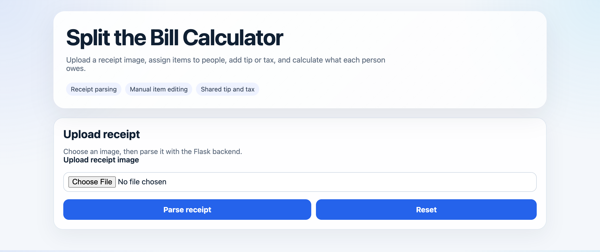
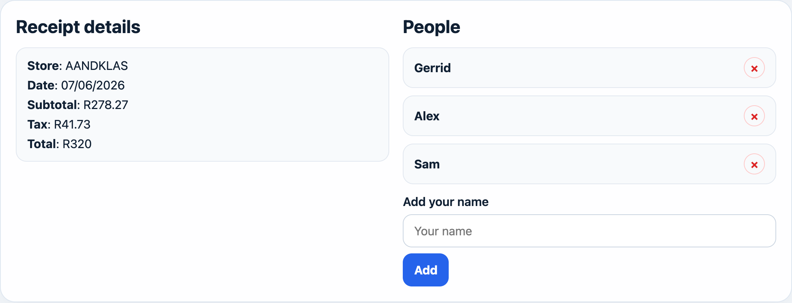
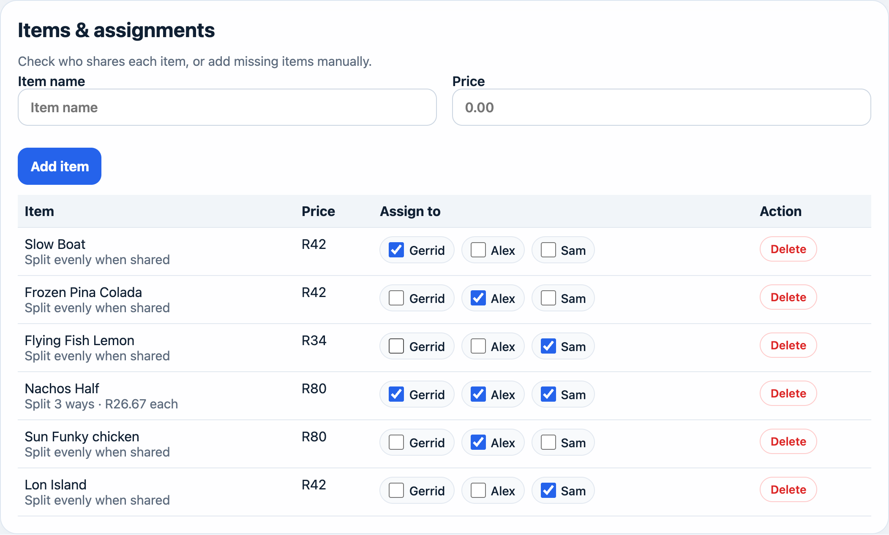
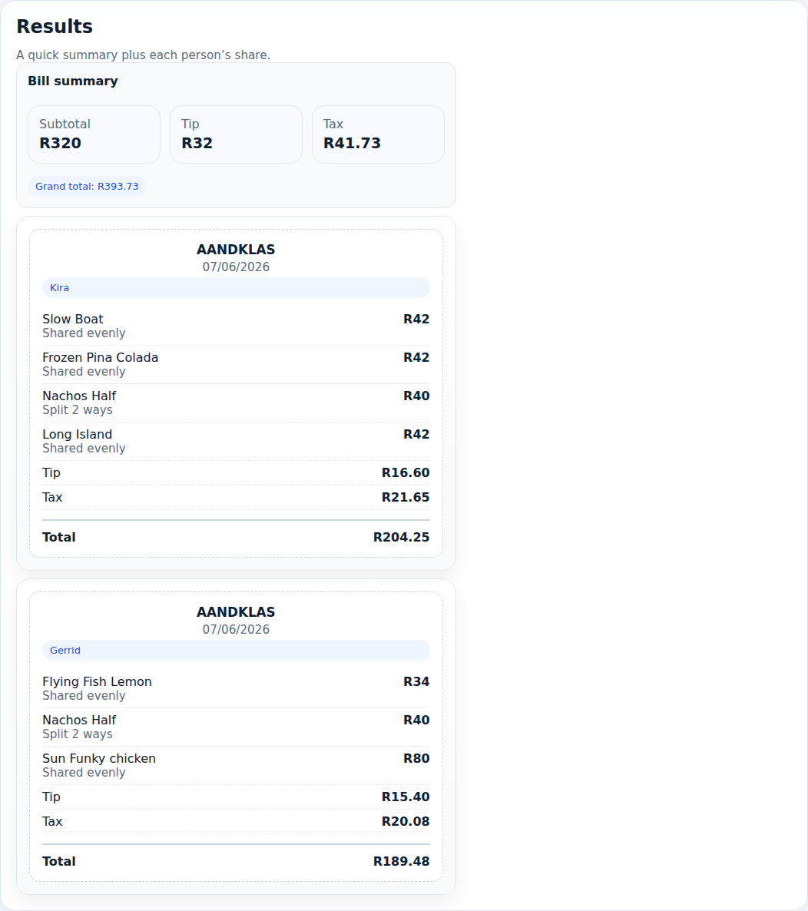

# Split the Bill Calculator

Snap a photo of a restaurant receipt, let an AI vision model read the line items, tick off who had what, and get a clean per-person breakdown - including a fair share of the tip and tax.



## How it works

1. **Upload** a receipt photo (JPEG or PNG).
2. The Flask backend sends the image to a vision LLM (`qwen-omni-turbo` via an OpenAI-compatible API), which extracts the store, date, line items, subtotal, tax, and total. (we chose this api because it has a free tier)
3. **Add the people** at the table and **check who shared each item**. Items checked by multiple people are split evenly between them.
4. Pick a tip percentage and how to split the tip (proportional to what each person ordered, or evenly), and everyone gets their own receipt-style total.

## Demo

Parsed from the sample receipt in [`reciepts/aandklas_test.jpeg`](reciepts/aandklas_test.jpeg):



Assign items with checkboxes — shared items (like the nachos below) are split evenly between everyone who ticked them. Missing items can be added manually, and wrong ones deleted:



Each person gets their own mini receipt with their items, tip share, tax share, and total:



## Features

- Receipt image upload with live preview and AI-powered parsing
- Item assignment via checkboxes, with even splitting of shared items
- Tip calculation — split proportionally to item cost or evenly per person
- Tax read from the receipt and included in the split
- Manual item entry and deletion for parser misses
- Per-person receipt-style breakdown
- South African Rand (R) currency display
- Rate-limited parsing endpoint (10 requests/minute) with image validation

## Project structure

| File | Purpose |
|---|---|
| `index.html` | UI layout and styling |
| `webapp.js` | Frontend logic: upload, assignment, and split calculation |
| `rest_server.py` | Flask API, rate limiting, and static file serving |
| `image_extraction.py` | Receipt parsing via the OCR/LLM backend |
| `reciepts/` | Sample receipt image for testing |

## Getting started

### Requirements

- Python 3.10+
- An API key for the vision model backend

### Setup

Install dependencies:

```bash
pip install -r requirements.txt
```

Create a `.env` file in the project root with your API key:

```text
API_KEY=your-api-key-here
```

### Run

Start the Flask server:

```bash
python rest_server.py
```

Then open <http://127.0.0.1:5000> in your browser. Try it with the sample receipt at `reciepts/aandklas_test.jpeg`.

## API

### `POST /parse-receipt`

Accepts a multipart form upload with a `receipt` image field and returns the extracted data:

```json
{
  "store": "AANDKLAS",
  "date": "07/06/2026",
  "items": [
    { "name": "Slow Boat", "price": 42.0 },
    { "name": "Nachos Half", "price": 80.0 },
    ...
  ],
  "subtotal": 278.27,
  "tax": 41.73,
  "total": 320.0
}
```

Uploads are validated as real images before parsing, and the endpoint is rate-limited to 10 requests per minute.

## Notes

- Add at least one person before assigning items — new items default to the first person.
- Items checked by multiple people are split evenly between them.
- Tax is read from the receipt and split using the same method as the tip.

## Roadmap for the future

- Optional alternative OCR backend
- Better receipt parsing accuracy (especially taxes)
- Add support for other currencies and adding automatically adding tax to the total if applicable
- Export or print individual receipts
